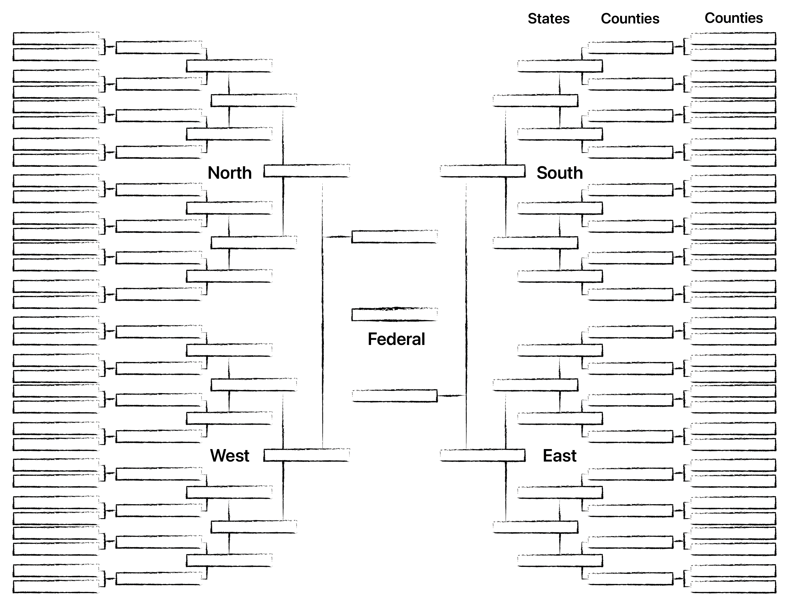

# 第 7 章 —— 政治晋级赛

如果优秀的治理技能就像是象棋比赛中的技能，会怎样？想象美国和中国决定通过各自的领导人参与象棋比赛来解决他们的分歧。人民希望确保自己的国家能赢，那么现存的 DINO 选举程序将怎样运行呢？

考虑一下，一般的投票人对于象棋是合理的无知，并且从来没有实际玩过。人们把自己分成党派，支持有不同下棋理念的候选人。人们只是得到了一个投票给象棋空谈专家的机会。

最终，这个被选出的总统将会是那个最善于说服别人相信他们会玩象棋的人 —— 一个基本上和真正的下棋不相关的技能。实际上，最好的象棋选手可能会害怕说服别人他们最会玩象棋。想象如果没有人可以下棋直到被选为总统。人们难以阅读象棋比赛的历史数据。你会押注如此选出的一个候选人吗？

如果美国需要象棋技能来赢过中国，那么大多数人会推荐通过锦标赛来找到最好的选手。每个有兴趣在与中国的象棋比赛中代表美国的人都可以参加。他们会被随机匹配来玩一局。第一轮的赢家将会和其他赢家随机匹配。这个过程持续，直到一个象棋冠军被确认，并且这个冠军将会迎战中国。这应该很清楚了，相比于投票，一个锦标赛远远更有机会发现和产生一个非常优秀的选手。

为了防止同一个顶级象棋选手终生统治。领导人可以从头部 1% 的象棋冠军中随机选出。这将会最小化作弊者确保赢得选举的机会，以及修正偶尔出现的神经不正常的象棋大师。

不幸的是，我们没有简便的方式来举办一个运营国家的锦标赛。然而，如果我们能设计一个比赛，检验跟优秀治理高度相关的技能，那么这将会是一个比今天我们所玩的党派政治游戏更合适的代表过程。

如果政府的目的是让一群人可以达成共识，那么它应该由某个最擅长共识建设艺术的人来领导。最优秀的共识建设者是一个能获得人们团结一致的授权的人；最差的人则是一个把人们分裂为对立党派的人。

为了发现最好的共识建设者，我们设立一个锦标赛，把人们随机分配到小组中（约 10 人）。每个组必须达成一个大多数人的强共识（约 7 / 10 的共识），决定他们中的一个成员来代表他们这一组。在计算机科学中，2 / 3 + 1 代表拜占庭容错的阈值。这将检验谁是每个组中最有效的共识建设者。一个不能达成共识的组，就像是一局时间耗尽的象棋比赛，这个组中没有人可以在锦标赛中继续前行。这个过程重复进行，直到最好的共识建设者被确认。

想象我们的社会会是什么样，如果每个民选职位上的人都需要这样一个过程。你觉得国会还会只有 30% 的支持率并且政府的信任度低于 20% 吗？如果中国也使用类似的程序，一笔贸易交易在两个共识建设专家之间达成的概率将是多大？

理论上，一个晋级赛系统可以允许十亿人在仅仅 8 到 9 个回合后确认一个国会/议会，每一回合分配给一个月的时间来达成共识。总之，这整个过程使用的时间应该会远少于人们从初选到普遍选举中花在竞选活动和辩论上的时间。然后国会或者议会从他们的成员中选择主席、副主席和最高法院。另外，立法、司法、行政系统可以有独立的锦标赛。

仅仅因为政治晋级赛可以拓展到数十亿人，并不意味着把每个人都组织在一个晋级赛层级结构中就是好的策略。这样做依然会违反个人和群体之间的相对权利法则；比如，如果没有明确的方式达成如何把社区解散为独立自治单元的共识，那么就没有简单的方式来“一走了之”。没法“一走了之”，说不的能力就丢失了，没法说不，谈判和授权的能力就丢失了，没有授权，就没有合法性，没有合法性，就没有民主。

为了更好的支持退出的权利，想象一个国家中的每个郡都用一个政治晋级赛来选出一个“管理者委员会”。因为一般的郡有 5 万人，这个晋级赛可以用仅仅 2 到 3 个回合完成，有机会在一天内全进行。一旦委员会被选出，它可以从成员中选择一个人来在更高层级上（比如州）来代表这个郡。

美国有 3141 个郡。想象如果每个郡都是自治的，并且能够加入任何能接受它的州或国家，而且不用向它之前所在的州或国家要求脱离的许可。在每个州内部，所有的郡将用一个政治晋级赛来任命他们的州议会代表。最后，如果他们选择，每个州可以加入一个联邦治理框架。

这个结构的关键部分就是它保持了用退出来解决分歧的能力。不喜欢当地郡管理委员会的人可以搬到隔壁的郡。一个不喜欢它的州的郡可以成为独立的国家或者加入其他的州。一个不喜欢“合众国”的州可以独立或者加入一个不同的联邦。

这里的原则是，更高级别的政府是“政府们的政府”。这最大化了局部自治，并且给了当地决定自己的路线的自由，让大家可以共同生活。如果我们想要一个世界政府，它应该由可以随时自由退出的独立国家组成。

## 撤销职位

某些情况下，一个代表可能死了或者背叛他的选民，以至于他必须在任期结束前被撤销职务。在任何时间，一个 10 人的组可以通过达成一个新的大于 2/3 的共识来改变他们的代表。这会产生一种流动民主的形式，作恶的人可以在他们做出更多伤害之前被发现和清除。

## 美国的变化

多个政府联合组成政府这样的结构更接近于美国原本的宪法，在第 17 修正案之前，是州立法机构选择联邦参议员。第 17 修正案实际上通过抹平个人和联邦政府之间的代表制金字塔，去掉了“州”在联邦层面的代表。州加入联邦时是预期他们可以有权利退出的。

另外的代表集中化发生在国会议员数量的封顶上。在 18 世纪初叶，每 5 万人有一个国会议员，现在，这已经大于 65 万人。这意味着，在线性关系上，国会议员的相对于个人的权力增长了 10 倍。由于非线性，帕累托分布，权力的属性，这也可能是国会议员相对于人民的权力增长了 100 倍。

通过转向一个“政府们的政府”的系统，每个郡可以有平均 5 万人口，3141 个郡任命的代表将和我们在原本的宪法下拥有的国会议员数量差不多。通过连接议会代表区到郡，我们可以最小化操控选区的机会。

从一个独立州的联邦到一个实际上的“名义上的民主”帝国的改变已经削弱了人民控制自己命运的实际权力。抵制分离的运动是现状夺走人民达成新共识的主要方式之一。

## 低科技政治晋级赛过程

任何民主程序都应该足够简单，以便任何社区都可以实现它而不依赖高科技解决方案。一个过程依赖越多的科技，它就越依赖一小部分科技服务商，并且对于大众来说越难以接触。而低科技解决方案应该可以从 50 人的小组扩容到由数十亿人组成的国家。

实现一个政治晋级赛需要把人们按 4 到 12 人随机分组，所用的方式要让每个参与的人都高度确定这是真的随机性。四个人是实现一个 2/3+1 拜占庭容错共识的最小要求。然后每个组必须选择他们的成员之一来代表这一组。让我们开始演示小规模下这个过程如何工作，然后拓展规模。

## 小于 200 人的社区

让我们从一个 50 人的小社区开始，比如一个教堂、俱乐部或者 50 个州的代表们。这个团体会在当地社区活动中心或者联谊大厅举办一个活动，设置 13 张 4 个人的桌子。一旦每个人都到场，主持人将带一盒纸牌到台上，并且给每个人在所有其他人面前洗牌的机会。然后，每个人排队领取一章纸牌。每张桌子将对应一个纸牌大小（A、2、3）。人们收到纸牌后去往与他们的纸牌对应的桌子。

一旦每个人都在他的桌子就位，讨论就可以开始，在这期间，人们协商决定谁能最好地代表他们那一桌。一旦一个人被确认，他会得到其他人的纸牌。一个人必须得到四张纸牌中的至少三张才能代表那一桌。

一旦所有桌都结束了，最多会有 13 个代表，每人至少有 3 张牌。这时，代表们可以在整个社区面前（在台上）进行一个讨论，选择一个领导者。这个领导者必须拥有至少 9/13 的选票（2/3+1）。在没能产生超级大多数共识的情况下，这个过程重来。一个可以防止从贿赂到名人偏见等一切问题的替代性方法是从头部的 13 个人中随机选择。另外一个替代方案是，让头部的 13 个人分成 3 个随机的小组，每个组挑选一个代表，然后从头部的 3 个人中随机选择。

这个过程可以拓展到最多 200 人，通过加入更多盒纸牌和增加初始的桌子容量到 12 人。

## 1000 人的社区

拓展政治晋级赛到 1000 人的社区需要程序上的一点变化。一个千人团体可以很容易找到一个大会厅，比如一个可以支持 100 张十人桌的学校。这种情况下，我们将会需要 20 盒两种不同样式的纸牌，比如红色背面和蓝色背面的纸牌。每张桌子对应一个值和背面颜色（例如，红色 A，蓝色 9，等等）。再一次，人们将可以参加洗牌，然后排成队取走一张牌，然后去到他们的桌子。每一张桌子将会有 10 个人，他们需要达成一个 7/10 的共识。

一旦所有桌子都选出了他们的代表，那么第二轮将用 100 人团体的规则展开。

## 一万人以上的社区

当一个社区达到一万人的时候，在任何单一地点开展都会显得人太多，这就是时候开始把人们分组成千人的选区。每个选区应该大致相同大小（在 900 到 1000 人之间），并且将会利用 1000 人社区的流程来选择一个选区代表。这 10 个选区代表将会碰面来选择最后的代表。

把人们分组成选区应该用抵抗主观操纵的健康的方法来完成。目标是防止人们合谋来破坏随机分布，并由此再次引入政党或者选区操控。这可以通过把人们按照随机分布的属性进行分组来完成。这样的一个例子是通过人们的生日来给人们分配选区。另外，选区可以用确定的算法性的、不容易受到选区操控影响的方式来组织，比如一个 GPS 网格。

## 十万人以上的社区

这和一个由 100 个选区代表组成的社区没什么不同。一个一百万人的社区将会和一个 1000 个社区代表组成的社区没什么不同。到此为止，你可以看到一个模式展现在眼前，它能够用少于 4 轮的活动拓展到数十亿人，每轮活动由 1000 人左右的小组们组成，并且用的只是广泛存在的纸牌。

在这个系统之下，任何人不可能“多投票”，任何“死人”或“动物”也不能投票。为了参与，你必须出现，并且这意味着你必须是活的而且一个时间只出现在一个地方。不仅如此，这也不需要竞选活动，因为你可以投票的人是随机分配到你的桌子上的。没有竞选活动，就没有现任优势、名人偏好、诋毁、媒体偏见、财富偏见，也没有任何竞选融资的需要。因为每个组需要达成 7/10 的共识，并且这些组无法提前协商，这就不会有能力形成政党。因为每次选举中，人们都是组织成新的随机小组，一个现任也没有基本盘。

## 高科技政治晋级赛

一个高科技解决方案将通过手机和区块链技术让每个人参与进来。在这种方法下，密码学技术将被用来创造一个可证明诚实的随机数。此算法的一个例子是用一个未来的比特币区块哈希。一旦这个随机数被选出，他将被用作一个把人分成十人一组的确定性随机算法的种子。

可以为所有的组创建一个聊天室，外加一个视频会议的选项。这个组可以被给予数小时或数月，用异步的方式来达成共识。然后这个组的成员将会投出他们的票给代表（他们可以更改很多次）。一旦 2/3 以上的成员达成一致，一个代表就被选出。

然后这个过程在代表们中重复。每个人都可以看到他们的代表在更高级别参与的讨论。

每个人都有一个机会来评价他们的代表，基于他们的代表表现地有多忠诚。然后，在接下来几年，当一个新的十人小组要决定是否来提名一位之前的代表时，这个信息可以被访问。

因为区块链的透明性和加密算法的公正性，我们知道这个系统是不可能像传统投票机一样被“攻击”。如果聊天室用互动性的视频会议来代替，并且被安排在同一时间，那么你还可以防止人们多次投票并且防止死人投票。不幸的是，这有一点难以防止外国人远程参与。

## 共识需要时间

共识需要时间，而且不应该经常更改，特别是对于变动将会影响很多人的大型社会。法律或者领导层的高频变更意味着事情的发生无法被人民处理、讨论和授权。没有授权，运营政府的人就已经违反了社会的和平条约，而且把人民带回了丛林法则状态。

想象一个每 12 个月改变一次领导人的独裁政府。执行长期计划对于一个社区将会变得不可能。这影响的不仅是政府，而且是每一项必须适应规则变化的业务。

你可以想象政府的权力就像是一个锁在银行保险柜中的宝藏。如果不采取预警措施，银行可能在任何人做出反应之前就被抢劫。银行不仅要担心外面的强盗，他们还得担心内部的监守自盗。

一个旨在让一些人当权的社区应该建立一个可以限制腐败操作者所能造成的破坏的程序。实现它的一种方式是利用银行保护资产的一些技术。

银行和很多商家保护他们的保险箱的方法之一是执行一个时间锁。意思是，保险箱的门只能在一段强制的延迟之后才能被打开。当我作为一个少年在多米诺披萨店打工的时候，我们必须在需要使用现金前 30 分钟解锁保险箱。这个意义是，如果某个人尝试抢劫店铺，他们将不得不等待才能得到现金，即使他们可以强迫经理输入正确的密码。这个时间延迟给了警察反应的时间。

当通过新法律时，更长的延迟是有必要的，因为人群需要更长的时间才能组织和建立关于反对的共识。社会的法律应该是平稳的，并且设计成和相对不变的物理的和形而上的事实保持一致。底层事实的属性并没有快速变化，因此，我们的法律也不应该经常变更。

快速变化的规则/法律就像驾驶一架飞机，在操纵杆上下达命令和在仪表盘上看到结果有两分钟的间隔。除非改变非常小使得两分钟的影响足够细致才能正常移动，不然不可能驾驶这样的飞机。突然的移动可能会使飞机坠毁，甚至在仪表显示出问题之前。法律的政治、经济和生态影响可能花费几十年或者几个世纪才能显示出来。

实现这种检查和平衡的一种方式是要保证一个国会提出的法律在生效之前必须被一整轮选举之后的下一届国会签署。这将意味着，从一项法律在国会中得到 2/3 以上同意开始，它将需要至少四年时间，在这期间它可能会被接下来的国会撤销。在四年之后，新的国会将需要以 2/3 以上的同意来签署他。如果它没有被下一届国会续期，那么这项法律将自动失效。只有在保持了 20 年之后，自动失效的条款才能结束，这项法律变成自动续期，直到一个改变它的新提案通过并且被签署。

一个可以在四个政治晋级赛赛季保持共识的法律，并且依然得到 2/3 以上的签署，是一项拥有广泛共识的法律。一项无法在此期间维持共识的法律可能是由于恐慌或腐败而起草的。政治学上有一句话，“永远不要浪费一次危机”。含义是在混乱时期，人们可能被政客、媒体和其他有影响力的人利用，他们准备引入其他情况下永远不会通过的法律。这种法律的例子包括银行救济和“爱国者”法案。没有法律应该在紧急状态下被通过。在一个真正的紧急状况下，在一系列稳定法律下的自由市场和自愿合作可以弥合欠缺。为“紧急状态”实行例外就是在给暴政开后门，因为领导人可以宣布紧急状态只要他们的政治宣传可以吓到人民。

你可能在做出改变生活的重大决策之前听过“睡一觉”的建议。对于不能反悔的决策，这是尤其好的建议。一个执行了强制延迟的治理系统给了人们时间“睡一觉”。这个简单的延迟决策的行为给了潜意识时间在情感上处理影响。最终结果是，平均来看，人们做出更好的决策，并且避免“冲动消费”类似的事情。

## 利用帕累托力量

我花费了过去的十年，来实验为抵抗少数人控制而设计的科技。比特币背后的想法是，你可以利用一个抗审查的公共账本来保护自己免受银行和政府捕获你的数字资产。如果任何人能够控制谁来发布账本，那么他们就能冻结资金和强迫服从。为了像金子那样保护财产权，一个加密货币协议应该稳定并且几乎不可能更改或审查。

一开始，任何人可以用自己的个人电脑参与比特币的共识程序。早期，我仅仅用我的电脑就在比特币网络上生产了很多区块。当在这个规模下运行时，每个拥有电脑的人都可以确信他们的交易不会被审查。

随着比特币社区增长，规模经济接替主导，今天控制 51% 区块生产的仅仅是三个不同的公司。有了 51%，他们能够审查任何包含他们不喜欢的交易的区块。更进一步，特殊的硬件被创造出来，这让只有普通电脑的个人要想确保他们的的交易被包含就变得不划算。因为硬件、技能和基础设施是很高的入门门槛，矿池的腐败（可以被看作政党）成为了一个潜在的问题。

一个类似的过程发生在其他所有区块链共识算法中。帕累托原理发挥效应，1% 的人掌握 51% 的影响力，这意味着 1% 最终掌握控制权。一个想要保护自己免受控制的社区需要抵消帕累托原理。

我们已经看到随机性在摆平帕累托的影响上是有效的。我们也已经看到随机性让“中间”技能水平的人当权，并且中间水平远远低于最好可能的技能。我们也了解到，每个我们创造的“游戏”会选出帕累托分布中不同集合的人。工作量证明，像比特币，选择科技技能和靠近便宜的电力。质押证明的区块链，就像我曾经创造的那些，倾向于选择富人和管理着别人充值的代币的交易所。

我们也已经看到一些游戏，比如现代政党政治，选出有病态特点的人。通过把游戏改变成像政治晋级赛一类的事情，我们可以从一个更具有优秀品质的帕累托分布中选择。我们面临的问题是，任何单一的分布都可能只有一个狭窄的领域。比如，如果政治晋级赛从共识建设者中选择，那么它可能就排除了策略思考者和工程师。管理一个社会所需要的技能，可能得在一系列多样的特征上形成共识，没有一个单独的帕累托分布能对此进行优化。

假设技能集合并不完全重叠，在多个帕累托分布中分配影响力可以增加影响力的多样性和去中心化程度。但挑战变成了要确认一些列独特的游戏来发现最好中的最好。

从这个角度出发，也许利用象棋、围棋、扑克牌、单词拼写、星际争霸或者机器人大战之类的游戏是有意义的。使用这些游戏，我们能发现人群中的一个子集，他们拥有在多个维度里平均以上的智力和技能。人们不太可能合谋操纵这么多系列的游戏。但挑战之一是达成从哪些游戏中选人的共识。不论是哪个游戏，重要的是某种形式的分配（随机选取）要被应用，以便任何类别内的领导层不僵化。

我认为政治晋级赛共识程序可以选出足够有能力的人来就这一系列游戏达成共识。不过，从多个帕累托晋级赛头部随机选取领导者也许意味着不必要的复杂性。

## 专家统治

很多人宣扬我们应该让科学家和其他“专家”来告诉我们如何组织社会。如果这些人真的知道什么是最好的，那么每个人都应该追随他们。的确，最好的和最聪明的人处在更有利于做出明智决策的地位；但是，问题是如何识别他们，同时不给腐败留后门。

纵观历史，当权者曾在火刑柱上烧死人因为他们不同意当时的“科学”。诸如地球绕着太阳转和接生婴儿之前洗手有好处这样的想法过去被认为是异端。在现代，“科学”是被有政治动机的人资助的，结果是信息的不完整。从一个纯逻辑的角度，专家统治犯了诉诸于权威的错误，因此应该作为一个逻辑谬误被抛弃。

如果你们想被专家统治，那你们仍然需要对谁是最好的达成共识，你们也必须用一种不被政治偏见侵蚀和自我证明的“科学”来做到这一点。不能存在一个册封“专家”的“学术阶级”或者“媒体阶级”，否则学术阶级会代表一个隐藏的权力结构，操控政治权力为个人牟利。

让一个单独领域的专家来设置政策的一个问题是他们缺少跨学科的知识。例如，从医学角度看最好的选择，从经济角度看可能就是灾难性的。在试图用一个学科的知识来拯救生命时，你可能会因为没有考虑其他学科的因素而杀死更多的人。请记住，大多数人对于好的治理、哲学和经济学是合理地无知。即使是医生、工程师和科学家，也对他们领域之外的事情合理地一无所知。另外，那些在自己领域里的专家往往对自己在其他领域的知识过于自信。

正是由于这个原因，选择具有逻辑、修辞、数学、博弈论、记忆力等抽象技能的人，远比选择任一特定行业具有高度专业知识的人要好。一个管理机构应该由能够从第一性原理进行推理和谈判的人组成。此外，这些技能应该通过有明确规则和客观赢家的游戏来测试（这样作弊就很难），而不是依据 "发表文章最多或政治关系最密切的学术委员会委员"。最后，无论如何衡量技能，都必须使用随机性在所有通过门槛的人中进行选择。

## 政治晋级赛总结